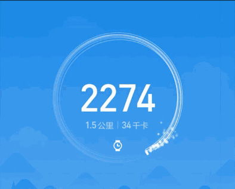

# MISportsConnectWidget
【仿写酷界面】【HenCoder】仿小米运动的运动记录界面

# 介绍
本项目为 [HenCoder](http://hencoder.com) 的 [仿写酷界面](http://hencoder.com/activity-mock-1/) 投稿，投稿项目为：**3.小米运动首页顶部的运动记录界面**。 HenCoder 有多牛逼呢？就是这个项目仅靠它的 4 篇自定义控件文章就可以完成了。 

平时工作没什么机会做 UI，这次投稿也可以说是很~~想要相机~~用心了！

# 效果图
原版效果：



模仿效果：


对不起放错了：


# 工程文件清单

```

app: 使用控件的模块
    MainActivity：主界面

misportsconnectview
    MISportsConnectView：小米运动控件
        AnimationState：动画状态机
        AnimationThread：动画控制线程

    FireworksCircleGraphics：烟花圆环实现类，代码较多单独独立出来
        StartArgument：烟花圆环上的星星，负责存储当前运动状态及下一帧运动状态
        StartArgument：烟花圆环上的线条，负责存储当前运动状态及下一帧运动状态

    SportsData：view 使用到的数据的 bean
    LogUtils：日志工具类
    DensityUtils：dp，px，sp 的转换工具类

```

# 比较满意的地方

* 做了一些性能优化
* 做了一些工程化处理，可以直接用啦
* 相关的界面参数都提取成常数了，没有 magic number，方便修改参数
* 给烟花圆环加了一些骚动画
* 加了新版小米运动圆环会微微颤抖的类似海市蜃楼的骚效果

# 不满意的地方

* 为了优化性能，动画参数计算限制了 1 秒 60 次，后面所有的参数都是基于这个设定来设置的。结果发现会导致很多计算出问题，比如加速度参数一下子超过了临界值，变成上面那个失败的动图那样天外飞仙。
* 瞎掰一套动画公式，导致调试参数调试了很久
* 原控件的大圆环上的光晕看起来应该是几个半透明椭圆的叠加，我想着能不能做的更好看一点，结果各种碰壁。。还是太年轻了。最后用回原方案

# 后记
水平不够，时间来凑

这三个月学到很多，比心！

